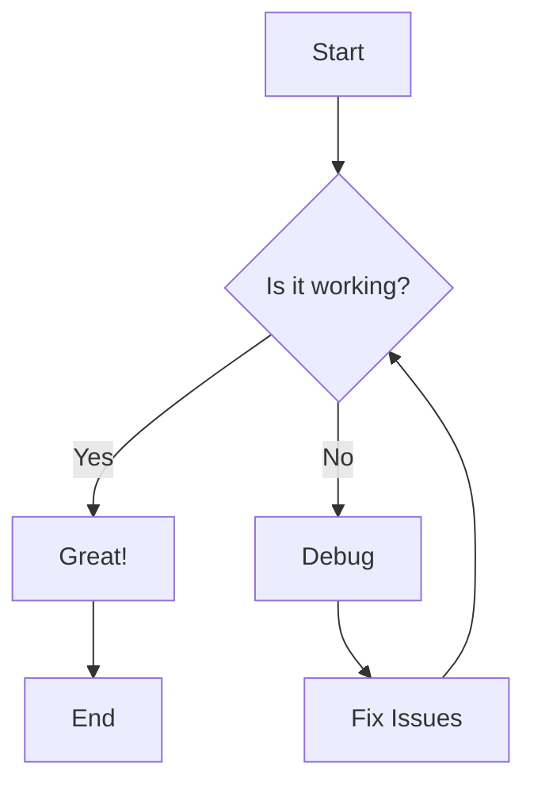
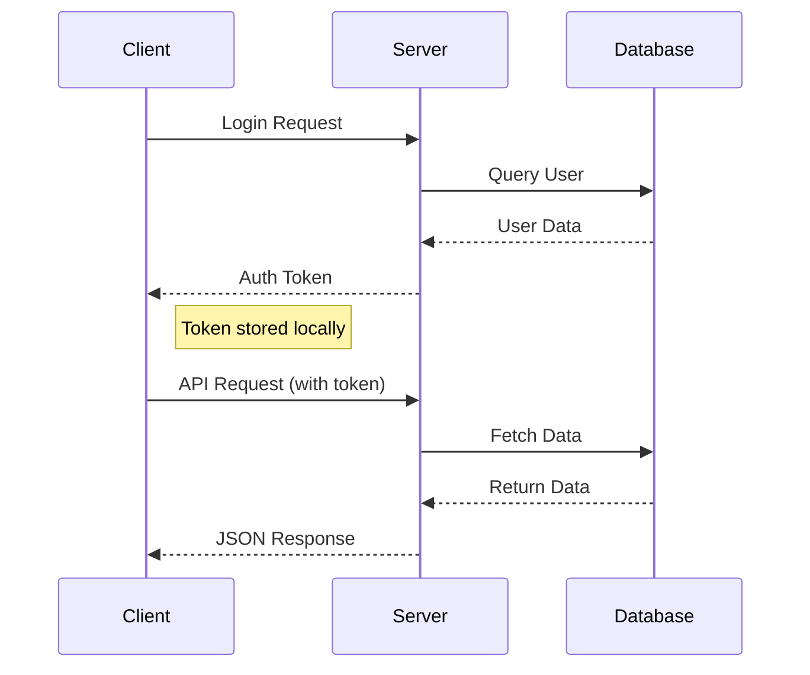
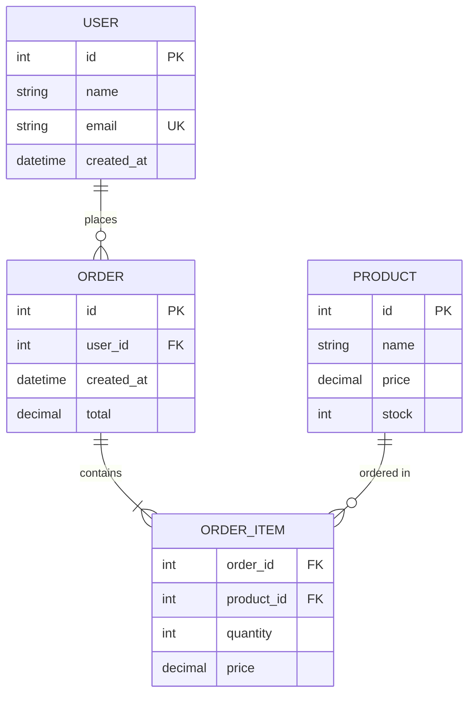
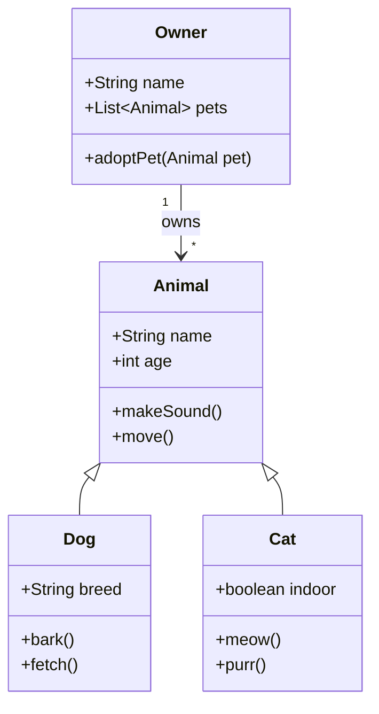

# Advanced Markdown Features

Explore the extended capabilities of Markdown beyond the basics. These features are often platform-specific but incredibly powerful for technical documentation.

## Table of Contents
- [Mermaid Diagrams](#mermaid-diagrams)
- [Advanced Math](#advanced-math)
- [Interactive Elements](#interactive-elements)
- [Custom HTML](#custom-html)
- [Metadata and Frontmatter](#metadata-and-frontmatter)
- [Platform-Specific Extensions](#platform-specific-extensions)

## Mermaid Diagrams

### Flowcharts



**Code:**
````markdown

````

### Sequence Diagrams



### Git Graphs

```mermaid
gitgraph
    commit id: "Initial"
    branch develop
    checkout develop
    commit id: "Feature A"
    commit id: "Feature B"
    checkout main
    merge develop
    commit id: "Release v1.0"
    branch hotfix
    checkout hotfix
    commit id: "Bug fix"
    checkout main
    merge hotfix
    commit id: "v1.0.1"
```

### Entity Relationship Diagrams



### Class Diagrams



## Advanced Math

### Matrices

$$
\begin{pmatrix}
1 & 2 & 3 \\
4 & 5 & 6 \\
7 & 8 & 9
\end{pmatrix}
\begin{pmatrix}
x \\
y \\
z
\end{pmatrix}
=
\begin{pmatrix}
a \\
b \\
c
\end{pmatrix}
$$

### Complex Equations

$$
\begin{align}
\frac{\partial u}{\partial t} &= \alpha \frac{\partial^2 u}{\partial x^2} \\[10pt]
u(0, t) &= u(L, t) = 0 \\[10pt]
u(x, 0) &= f(x)
\end{align}
$$

### Statistical Formulas

The probability density function of a normal distribution:

$$
f(x|\mu,\sigma^2) = \frac{1}{\sqrt{2\pi\sigma^2}} e^{-\frac{(x-\mu)^2}{2\sigma^2}}
$$

The Central Limit Theorem states that for large sample sizes:

$$
\bar{X}_n \xrightarrow{d} \mathcal{N}\left(\mu, \frac{\sigma^2}{n}\right)
$$

### Chemical Formulas

Inline chemistry: H~2~SO~4~ + 2NaOH → Na~2~SO~4~ + 2H~2~O

Block chemistry:
$$
\ce{CaCO3 + 2HCl -> CaCl2 + H2O + CO2 ^}
$$

## Interactive Elements

### Collapsible Sections

<details>
<summary><strong>🔍 Expand for detailed explanation</strong></summary>

This content is hidden by default but can be revealed by clicking the summary. This is perfect for:

- FAQ sections
- Optional technical details
- Long code examples
- Supplementary information

You can include **any** markdown content inside:

```javascript
function example() {
    console.log("Hidden code example");
}
```

And even nested details!

<details>
<summary>Nested section</summary>

This is nested inside the first details element.

</details>

</details>

### Progress Indicators

Task completion: 

<progress value="75" max="100">75%</progress>

### Interactive Code Examples

```html
<!-- Live example -->
<div style="background: linear-gradient(45deg, #ff6b6b, #4ecdc4); 
            padding: 20px; 
            border-radius: 10px; 
            color: white; 
            text-align: center;">
    <h3>Interactive Demo</h3>
    <p>This HTML will render directly in most Markdown processors!</p>
    <button onclick="alert('Hello from Markdown!')">Click Me!</button>
</div>
```

## Custom HTML

### Styled Components

<div align="center">
  
</div>

<table>
  <tr>
    <td bgcolor="#ff6b6b" align="center" style="color: white; padding: 10px;">
      <strong>Important Notice</strong>
    </td>
  </tr>
  <tr>
    <td style="padding: 10px; border: 1px solid #ddd;">
      This is a custom HTML table with styling that goes beyond standard Markdown tables.
      It can contain complex layouts and formatting.
    </td>
  </tr>
</table>

### Custom Alerts

<div style="border-left: 4px solid #ff6b6b; background: #fff5f5; padding: 1rem; margin: 1rem 0;">
  <strong>⚠️ Warning</strong><br>
  This is a custom warning alert using HTML styling.
</div>

<div style="border-left: 4px solid #4ecdc4; background: #f0fdfa; padding: 1rem; margin: 1rem 0;">
  <strong>💡 Tip</strong><br>
  Custom tip box with HTML styling for better visual hierarchy.
</div>

<div style="border-left: 4px solid #ffd93d; background: #fffdf0; padding: 1rem; margin: 1rem 0;">
  <strong>📝 Note</strong><br>
  Information box that stands out from regular text content.
</div>

### Embedded Content

<iframe width="560" height="315" src="https://www.youtube.com/embed/dQw4w9WgXcQ" frameborder="0" allowfullscreen></iframe>

<iframe src="https://codesandbox.io/embed/vanilla" style="width:100%; height:500px; border:0; border-radius: 4px; overflow:hidden;" title="Code Example"></iframe>

## Metadata and Frontmatter

### YAML Frontmatter

```yaml
---
title: "Document Title"
description: "Brief description"
date: "2024-12-01"
author: "Author Name"
tags: 
  - tag1
  - tag2
  - tag3
category: "Category"
featured: true
draft: false
weight: 10
aliases:
  - /old-url/
  - /another-old-url/
custom_css: "special-styling.css"
custom_js: "interactive-features.js"
---
```

### TOML Frontmatter

```toml
+++
title = "Document Title"
description = "Brief description"
date = "2024-12-01"
author = "Author Name"
tags = ["tag1", "tag2", "tag3"]
category = "Category"
featured = true
draft = false
weight = 10
+++
```

### JSON Frontmatter

```json
{
  "title": "Document Title",
  "description": "Brief description",
  "date": "2024-12-01",
  "author": "Author Name",
  "tags": ["tag1", "tag2", "tag3"],
  "category": "Category",
  "featured": true,
  "draft": false,
  "weight": 10
}
```

## Platform-Specific Extensions

### GitHub Features

#### Task Lists with Sub-tasks

- [x] Main task completed
  - [x] Sub-task 1 ✅
  - [x] Sub-task 2 ✅
  - [ ] Sub-task 3 🔄
- [ ] Second main task
  - [ ] Research phase
  - [ ] Implementation phase

#### GitHub Alerts

> [!NOTE]  
> Useful information that users should know, even when skimming content.

> [!TIP]
> Helpful advice for doing things better or more easily.

> [!IMPORTANT]  
> Key information users need to know to achieve their goal.

> [!WARNING]  
> Urgent info that needs immediate user attention to avoid problems.

> [!CAUTION]
> Advises about risks or negative outcomes of certain actions.

#### Mentioning Users and Issues

- @username - Mention a user
- #123 - Reference an issue or pull request
- SHA: 16c999e8c71134401a78d4d46435517b2271d6ac
- User@SHA: octocat@16c999e8c71134401a78d4d46435517b2271d6ac
- User/Repository@SHA: octocat/Hello-World@16c999e8c71134401a78d4d46435517b2271d6ac

#### Emoji Reactions

You can add emoji reactions to comments:
- 👍 `:+1:`
- 👎 `:-1:`
- 😄 `:smile:`
- 🎉 `:tada:`
- 😕 `:confused:`
- ❤️ `:heart:`
- 🚀 `:rocket:`
- 👀 `:eyes:`

### GitLab Features

#### Maths in GitLab

Inline math: $`a^2+b^2=c^2`$

Block math:
```math
a^2+b^2=c^2
```

#### Audio and Video


### Obsidian Features

#### Wikilinks

[[Page Name]] - Link to another page
[[Page Name|Display Text]] - Link with custom text
[[Page Name#Section]] - Link to a specific section

#### Block References

Reference a specific paragraph or block:
^block-reference-id

Link to it: [[Page Name#^block-reference-id]]

#### Embedded Notes

![[Another Note]] - Embed entire note
![[Another Note#Section]] - Embed specific section

### Notion Features

#### Databases

| Name | Status | Priority | Due Date |
|------|--------|----------|----------|
| Task 1 | In Progress | High | 2024-12-15 |
| Task 2 | Not Started | Medium | 2024-12-20 |
| Task 3 | Complete | Low | 2024-12-10 |

#### Callout Blocks

> 💡 **Tip**
> This is a tip callout block with custom styling.

> ⚠️ **Warning**  
> This is a warning callout with important information.

## Advanced Formatting Techniques

### Multi-column Layouts

<div style="display: flex; gap: 2rem;">
<div style="flex: 1;">

**Column 1**
- Item 1
- Item 2
- Item 3

</div>
<div style="flex: 1;">

**Column 2**
- Item A
- Item B
- Item C

</div>
<div style="flex: 1;">

**Column 3**
- Option X
- Option Y
- Option Z

</div>
</div>

### Image Galleries

<div style="display: grid; grid-template-columns: repeat(auto-fit, minmax(200px, 1fr)); gap: 1rem;">
  
  
  
  
</div>

### Code Comparison

<div style="display: flex; gap: 1rem;">
<div style="flex: 1;">

**Before:**
```javascript
// Old approach
function processData(data) {
  var result = [];
  for (var i = 0; i < data.length; i++) {
    result.push(data[i] * 2);
  }
  return result;
}
```

</div>
<div style="flex: 1;">

**After:**
```javascript
// Modern approach
const processData = (data) => {
  return data.map(item => item * 2);
};
```

</div>
</div>

## Performance and Optimization

### Large Documents

For very large Markdown documents:

1. **Use heading anchors** for navigation
2. **Split into multiple files** and link between them
3. **Lazy load images** with appropriate attributes
4. **Minimize complex HTML** for faster parsing
5. **Use caching** for generated content

### Best Practices for Advanced Features

✅ **Do:**
- Test advanced features on your target platform
- Provide fallbacks for unsupported features
- Use semantic HTML when possible
- Keep accessibility in mind
- Document platform-specific requirements

❌ **Avoid:**
- Over-relying on platform-specific features
- Complex nested HTML that's hard to maintain
- Heavy interactive elements that slow rendering
- Breaking content across too many collapsible sections

## Troubleshooting Advanced Features

| Issue | Solution |
|:------|:---------|
| Mermaid not rendering | Check platform support, verify syntax |
| Math not displaying | Ensure MathJax/KaTeX is enabled |
| HTML not working | Check if HTML is allowed in processor |
| Custom CSS not applying | Verify CSS injection method |
| Interactive elements broken | Test JavaScript execution permissions |

## Further Learning

- **Mermaid Documentation**: https://mermaid-js.github.io/mermaid/
- **KaTeX Documentation**: https://katex.org/docs/supported.html
- **HTML in Markdown**: Platform-specific documentation
- **CommonMark Extensions**: https://github.com/commonmark/commonmark-spec/wiki/List-of-CommonMark-Implementations

---

**Next Steps**: Experiment with these advanced features on your preferred platform. Not all features work everywhere, so always test before relying on them in production documents.

**See Also**: 
- [Complete Syntax Reference](1_complete_syntax.md)
- [Best Practices](2_best_practices.md)
- [Cheat Sheet](3_cheat_sheet.md)